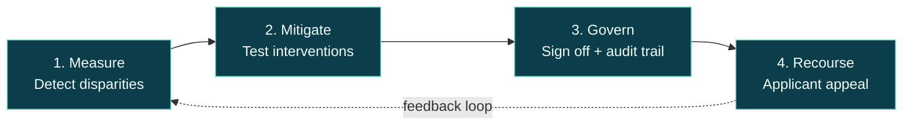
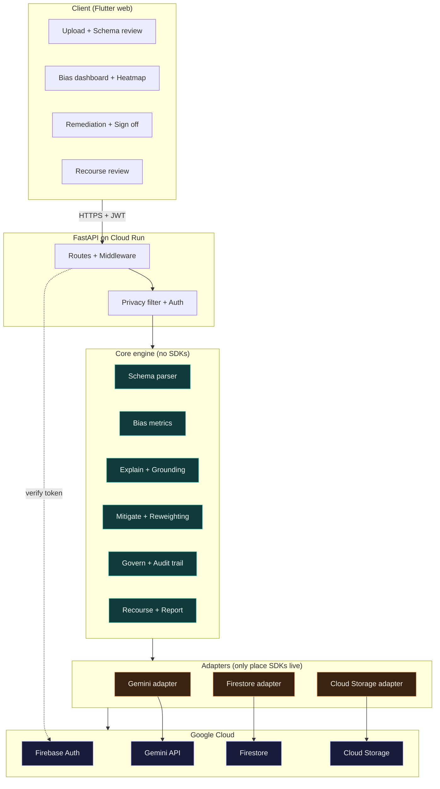
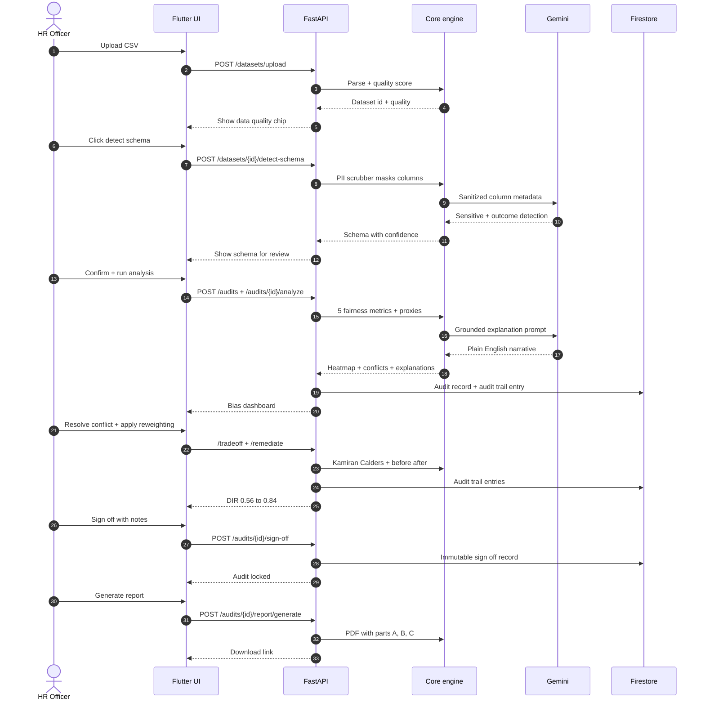
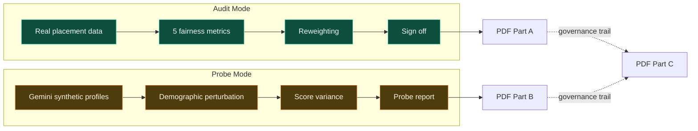

# NyayaLens

> *The Eye of Justice.*
> A no code accountability console for the AI tools that decide who gets hired.

[](LICENSE)
[](docs/system-design.md)
[](#status)

---

## Why NyayaLens exists

83% of employers now run automated screening on every résumé that lands in their inbox. The model is trained on twenty years of hiring decisions made by humans, and those decisions were not neutral. So the model learns the same patterns, scales them, and hides them behind a number.

The hard part is not measuring the bias. AIF360, Fairlearn, and Aequitas have done that for years. The hard part is everything that happens *after* the bias shows up:

* Who is responsible when the algorithm discriminates?
* Who decides which fairness tradeoff is acceptable?
* Where is the paper trail proving the company actually looked?
* What does the rejected applicant get to see, and how do they appeal?

These questions are answered today by either a $30k a year enterprise platform or by a Python script no HR team will ever run. NyayaLens sits in the middle. It is free, it works in a browser, and it walks one HR officer through the full lifecycle in under five minutes.

The EU AI Act flips on August 2, 2026 and classifies hiring AI as high risk. India's AI Governance Sutras already demand fairness, accountability, and a path to recourse. NyayaLens is the missing console for everyone who has to comply but cannot afford an enterprise contract.

---

## The four layer accountability stack

NyayaLens implements a complete loop, not just a metric library.



| Layer | What it does |
|---|---|
| **1. Measure** | Gemini reads your CSV, finds the sensitive columns, runs five fairness metrics, paints a heatmap, and explains every cell in plain English. |
| **2. Mitigate** | Reweighting, proxy detection, and LLM prompt hardening, with a before and after view. Nothing applies without a human approving it. |
| **3. Govern** | Named sign off, conflict resolution between disagreeing metrics, and an immutable audit trail of who did what and why. |
| **4. Recourse** | A plain language summary the applicant can read, plus a workflow for them to file, your reviewer to assign and resolve, and an appeal trail back into the audit. |

Most tools cover layer 1. A few cover layer 2. NyayaLens is the one that covers all four for free.

---

## What you get in 60 seconds

1. **Upload** a placement CSV.
2. **Confirm** the schema Gemini detected. (Gender and Category as sensitive, Placed as outcome.)
3. **Read** the bias heatmap. Disparate Impact for Gender lands at 0.49, well below the EEOC 80% rule.
4. **Resolve** the conflict between Demographic Parity and Equal Opportunity. Pick one and write why.
5. **Apply** Kamiran Calders reweighting. DIR moves from 0.56 to 0.84, with the accuracy delta visible.
6. **Sign off** with a documented justification.
7. **Generate** a PDF report with three labeled sections: real data findings, LLM probe results, and the governance trail.

The full demo script with click by click talking points lives at [`docs/demo-script.md`](docs/demo-script.md).

---

## How it fits together

A modular monolith with a strict dependency rule: the core engine knows nothing about Firebase, Gemini, or HTTP. Adapters do.



A CI test (`tests/contract/test_import_graph.py`) fails the build if any module under `core/` ever imports an SDK. That is how we keep the engine portable.

**Privacy is a type, not a convention.** The Gemini adapter accepts only `LLMPayload` envelopes built by the `PrivacyFilter`. A raw string passed by mistake is a mypy error, not a runtime PII leak.

---

## The full audit lifecycle



Every state changing call writes one entry to the `audit_trail` collection: who, when, what, and why. Sign off makes the audit immutable, which is enforced both in code and in the Firestore security rules.

---

## Repository layout

```
NyayaLens/
├── backend/        FastAPI service. Metrics engine, Gemini adapter, PDF generator
├── frontend/       Flutter web client. Upload, schema, dashboard, recourse review
├── shared/         JSON schemas, sample data, Firestore rules
├── infra/          Firebase emulator + Cloud Run config
├── docs/           System design doc, ADRs, runbook, demo script
└── .github/        CI workflows
```

Two rules govern the layout:

* `backend/nyayalens/core/` is domain agnostic. No Firebase, no Gemini, no FastAPI imports. CI enforces it.
* `backend/nyayalens/adapters/` is the only layer that touches external SDKs.

---

## Run it locally

You need Python 3.11, Flutter 3, the Firebase CLI, and a Gemini API key.

### Step 1, start the Firebase emulators

```sh
firebase emulators:start --only auth,firestore,storage
```

### Step 2, start the backend

```sh
cd backend
python -m venv .venv
. .venv/bin/activate         # macOS or Linux
# . .venv/Scripts/activate   # Windows bash
pip install -e ".[dev]"
cp .env.example .env          # then fill GEMINI_API_KEY
pytest                        # 106 tests, should be green
uvicorn nyayalens.main:app --reload --port 8000
```

### Step 3, start the frontend

```sh
cd frontend
flutter pub get
flutter run -d chrome --dart-define=API_BASE=http://localhost:8000/api/v1
```

The backend reads `FIRESTORE_EMULATOR_HOST` and `FIREBASE_AUTH_EMULATOR_HOST` automatically, so step 1 has to come first.

---

## Deploy

The live stack runs on **Cloud Run** (FastAPI) and **Firebase Hosting** (Flutter web), both under project `nyayalens-28b93`. Public URL: **https://nyayalens-28b93.web.app**.

After a local change, only the side you touched needs to ship. The repo has thin scripts under `scripts/` and `make` aliases that wrap them.

```sh
make deploy-frontend   # Flutter rebuild + Firebase Hosting deploy (~2 min)
make deploy-backend    # Container rebuild + Cloud Run deploy (~5 min)
make deploy            # Both, backend first
make smoke             # /health + Hosting + /api rewrite check
make logs-backend      # Last 50 Cloud Run log lines
make tests             # pytest + flutter test (no deploy)
```

On Windows without `make`, run the PowerShell scripts directly:

```powershell
./scripts/deploy-frontend.ps1
./scripts/deploy-backend.ps1
./scripts/deploy-all.ps1
./scripts/smoke.ps1
./scripts/logs-backend.ps1
```

The backend script refuses to deploy a dirty `backend/` worktree so the image SHA always matches what's in git. Both deploy scripts run a `/health` smoke test and exit non-zero if anything fails.

**First time setup** (once per laptop or fork):

```powershell
gcloud auth login
gcloud config set project nyayalens-28b93
firebase login
firebase use nyayalens-28b93
```

Plus a Gemini API key stored in Secret Manager as `GEMINI_API_KEY`.

**After a deploy:** hard refresh the browser (Ctrl+Shift+R). Firebase Hosting caches `index.html` for an hour, so without a hard refresh you may keep seeing the previous bundle.

**Roll back the backend** to a previous revision if a deploy regresses something:

```powershell
gcloud run revisions list --service nyayalens-api --region asia-south1
gcloud run services update-traffic nyayalens-api --region asia-south1 --to-revisions=<previous-revision>=100
```

Full deploy plan, IAM model, and runbook: [`docs/runbook.md`](docs/runbook.md).

---

## The demo dataset

`shared/sample_data/placement_synthetic.csv` is seeded with a known 3:1 demographic disparity. The expected demo path produces **DIR = 0.56** before reweighting and **DIR ≈ 0.84** after, which is the headline before and after moment.

You can regenerate it deterministically:

```sh
python backend/scripts/generate_synthetic_data.py --seed 42
```

Real placement data lives only on the team laptop. `placement_real_anchor.csv` is in `.gitignore`.

---

## Two evidence modes, never mixed

NyayaLens keeps two kinds of evidence visually and architecturally separate.



The mode field is on every audit record. The top bar of the UI shows a colored badge for data provenance: green for real, blue for benchmark, amber for synthetic, purple for LLM generated. Lifecycle endpoints like remediate and sign off are blocked on probe mode audits with a 409.

---

## Status

The MVP is shipped. End to end, the lifecycle works:

* Upload to schema to metrics to conflicts to tradeoff to remediate to recourse to sign off to PDF.
* LLM bias probe (job description scan and demographic perturbation).
* Recourse review (file, assign, resolve, with 409 handling for already resolved).
* Audit and probe mode separation with backend mode guard.

**Backend:** 106 tests across 21 files. Ruff and mypy strict clean. FastAPI on Cloud Run. Firestore + Cloud Storage adapters live behind a `USE_FIRESTORE` flag.

**Frontend:** 24 widget and contract tests on Flutter web. Five screens wired (Dashboard, New Audit, Audit Workspace, Recourse Review, Settings) with a redesigned shell.

**Done per the system design §6.1:** F1 through F11 are all in.

**Tracked as next steps (per system design §19):**

* Full `AppState` migration to Firestore (sinks are wired, state itself is still in memory).
* Production deploy on Cloud Run executed (runbook is ready, deploy is not).
* Gemma 4 local backend for privacy first deployments.
* Multivariate proxy detection.
* Counterfactual editor, threshold optimizer, representation balancing.
* Audit trail viewer screen, governance CRUD, scheduled audits, email notifications.

The full plan and rationale lives in [`docs/system-design.md`](docs/system-design.md). Sprint plan is §17, roadmap is §19.

---

## Documentation map

| Read this | When |
|---|---|
| [`docs/system-design.md`](docs/system-design.md) | You want the full pitch, market analysis, feature catalog, regulatory mapping, and roadmap |
| [`docs/demo-script.md`](docs/demo-script.md) | You are about to record or run the demo |
| [`docs/runbook.md`](docs/runbook.md) | You are deploying to Cloud Run for the first time |
| [`docs/CONTRIBUTING.md`](docs/CONTRIBUTING.md) | You are about to send a PR |
| [`docs/adr/`](docs/adr/) | You want the why behind a specific architectural decision |
| [`NOTICE`](NOTICE) | You want the full open source attribution list |

---

## Standing on shoulders

NyayaLens reads from but does not wrap a long line of fairness research. The full attribution and license trail is in [`NOTICE`](NOTICE). In short:

* **AIF360** (IBM) for metric breadth and reweighting reference.
* **Fairlearn** (Microsoft) for clean MetricFrame patterns and edge case handling.
* **Aequitas** (UChicago) for the 80% rule audit framing.
* **Presidio** (Microsoft) for the Indian PII recognizers.
* **Holistic AI** for the cleanest binary group metric API to study.
* **Responsible AI Toolbox**, **What-If Tool**, **LIT**, **Guardian AI** for UX patterns and design vocabulary.

We learn from these projects, port their test fixtures with attribution, and build the institutional layers (governance, sign off, recourse) that they all explicitly say are needed but do not implement.

---

## License

Apache 2.0. See [`LICENSE`](LICENSE) and [`NOTICE`](NOTICE).

Built for **Solution Challenge 2026: Build with AI** by **Team Zenith**.
